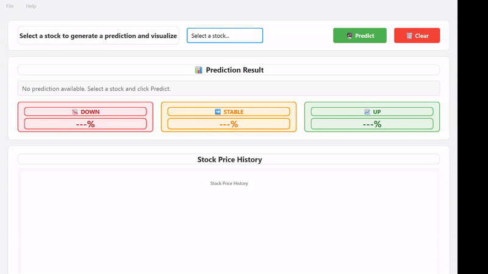

# 📈 TensorTrend

**AI-Powered Stock Price Prediction System with Desktop GUI**

A machine learning project that predicts next-day stock price movements using XGBoost, featuring a professional Qt-based desktop application for visualization and real-time predictions.


---

## 🌟 Features

- **Machine Learning Predictions**: 2 models : XGBoost-based, hidden markov model and LSTM combinaition  model for stock price movement prediction (UP/DOWN/HOLD) and LSTM model 
- **Multi-Stock Support**: Pre-configured for 5 major stocks (Coca-Cola, Tesla, Google, NVIDIA, Johnson and johnson)
- **Interactive GUI**: Modern Qt-based desktop application with real-time charts
- **Probability Distribution**: Detailed confidence levels for each prediction
- **Historical Visualization**: 120-day price history charts with Qt Charts
- **Automated Data Pipeline**: Python scripts for data collection and preprocessing

---

## 📊 Supported Stocks

| Stock | Symbol | Folder Name |
|-------|--------|-------------|
| Coca-Cola | KO | `Coca` |
| Tesla | TSLA | `Tesla` |
| Google | GOOGL | `Google` |
| NVIDIA | NVDA | `Nvidia` |
| Dick's Sporting Goods | DKS | `DSG` |

---

## 🏗️ Project Structure

```
TensorTrend/
├── app/                          # Desktop Application
│   ├── predictor/
│   │   ├── StockPredictor.h     # ML predictor class header
│   │   ├── StockPredictor.cpp   # ML predictor implementation
│   │   └── xgboost.dll          # XGBoost library
│   └── src/
│       ├── CMakeLists.txt       # Build configuration
│       ├── main.cpp             # Application entry point
│       ├── mainwindow.h/cpp     # Main UI logic
│       └── mainwindow.ui        # Qt Designer UI file
│
├── data/                         # Data Storage
│   ├── models/
│   │   └── final_xgb_3cat.json # Trained XGBoost model
│   ├── csv/                     # Stock data
│   │   ├── Coca/
│   │   │   ├── Coca_prices.csv      # Historical prices
│   │   │   └── XGBoostdata.csv      # Processed features
│   │   ├── Tesla/
│   │   ├── Google/
│   │   ├── Nvidia/
│   │   └── DSG/
│   └── scripts/                 # Data collection scripts
│       ├── Coca/
│       │   ├── collectprice.py
│       │   ├── fetch_data_ml.py
│       │   └── process_ml_data.py
│       └── [Other stocks...]
│
├── ML_model/                     # Machine Learning
│   └── xgboostv3.py             # Model training script
│
└── Documentation/
    ├── Diagrams.png
    └── accessdata.docx
```

---

## 🚀 Quick Start

### Prerequisites

- **Qt Framework** 6.10.0
- **CMake** 3.16+
- **Visual Studio** 2022 (Windows)
- **Python** 3.8+ (for data collection)
- **XGBoost** 3.1.0

### Installation

1. **Clone the repository**
   ```bash
   git clone https://github.com/yourusername/TensorTrend.git
   cd TensorTrend
   ```

2. **Install Python dependencies**
   ```bash
   pip install -r requirements.txt
   ```

3. **Set up XGBoost**
   - Download from: https://github.com/dmlc/xgboost/releases/tag/v3.1.0
   - Extract and note the paths for `include/` and `lib/`

4. **Configure CMakeLists.txt**
   
   Edit `app/src/CMakeLists.txt`:
   ```cmake
   # Update these paths
   set(CMAKE_PREFIX_PATH "C:/Qt/6.x.x/msvc2019_64")
   set(XGBOOST_INCLUDE_DIR "C:/path/to/xgboost/include")
   set(XGBOOST_LIB_DIR "C:/path/to/xgboost/lib")
   ```

5. **Build the application**
   ```bash
   cd app/src
   mkdir build && cd build
   cmake .. -DCMAKE_PREFIX_PATH="C:/Qt/6.x.x/msvc2019_64"
   cmake --build . --config Release
   ```

6. **Run**
   ```bash
   cd Release
   ./src.exe
   ```


---

## 💻 Usage

### Desktop Application

1. **Launch the application**
   ```bash
   ./app/src/build/Release/src.exe
   ```

2. **Select a stock** from the dropdown menu

3. **Click "Predict"**
   - View 90-day price history chart
   - See next-day prediction (UP/DOWN/HOLD)
   - Review probability distribution

4. **Click "Clear"** to reset and try another stock

### Data Collection

To update stock data:

```bash
# Example: Collect new Coca-Cola data
cd data/scripts/Coca
python collectprice.py        # Fetch latest prices
python fetch_data_ml.py       # Get ML features
python process_ml_data.py     # Process for model
```

### Model Training

To retrain the model:

```bash
cd ML_model
python xgboostv3.py
```

The trained model will be saved to `data/models/final_xgb_3cat.json`

---

## 🧠 Machine Learning Pipeline

### 1. Data Collection
- Historical price data from financial APIs
- Technical indicators calculation
- Feature engineering ( 19 features)

### 2. Data Processing
- Normalization and scaling
- Time-series feature extraction
- Target classification (3 classes: DOWN, HOLD, UP)

### 3. Model Training
- **Algorithm**: XGBoost Classifier
- **Features**: 23 technical indicators -> 60 features
- **Classes**: 3 (Down, Hold, Up)
- **Output**: Probability distribution

### 4. Prediction
- Load last 60 features from CSV
- Run inference with XGBoost
- Return prediction + probabilities

---

## 📸 Screenshots

### Main Interface

*Select stock and view predictions with confidence levels*
*Real-time prediction with probability distribution*


---

## 🛠️ Technical Stack

### Desktop Application
- **Framework**: Qt 6.x (C++)
- **Charts**: Qt Charts
- **ML Library**: XGBoost 3.1.0 C API
- **Build System**: CMake 3.16+
- **Compiler**: MSVC 19.x

### Machine Learning
- **Language**: Python 3.8+
- **ML Framework**: XGBoost
- **Data Processing**: Pandas, NumPy
- **Feature Engineering**: TA-Lib, scikit-learn

### Data Pipeline
- **Collection**: yfinance, Alpha Vantage API
- **Storage**: CSV files
- **Format**: Date-indexed time series

---

## 📈 Model Performance

- **Xgboost**

| Metric | Value |
|--------|-------|
| Accuracy | 52% |
| Precision (UP) | 50% |
| Precision (DOWN) | 55% |
| F1-Score | 53% |

- **Hmm +LSTM**


| Metric | Value |
|--------|-------|
| Accuracy | 60% |
| Precision (UP) | 61% |
| Precision (DOWN) | 53% |
| F1-Score | 56% |


---

## 🔧 Configuration

### Adding New Stocks

1. **Create data folders**
   ```bash
   mkdir data/csv/NewStock
   mkdir data/scripts/NewStock
   ```

2. **Add data collection scripts**
   - Copy from existing stock folder
   - Update stock symbol/ticker

3. **Update GUI dropdown**
   - Open `app/src/mainwindow.ui` in Qt Designer
   - Add new item to `comboBoxStock`

4. **Update stock mapping**
   ```cpp
   // In mainwindow.cpp -> getStockFolder()
   if (selectedStock.contains("NewStock")) return "NewStock";
   ```

### Customizing Features

Edit `ML_model/xgboostv3.py`:
```python
# Modify feature engineering
# Add new technical indicators
# Adjust model hyperparameters
```

---

## 🐛 Troubleshooting

### "Failed to load ML model"
- Verify model file exists at `data/models/final_xgb_3cat.json`
- Check file permissions
- Ensure path is relative to executable

### "Failed to load data from CSV"
- Verify CSV files exist in correct folders
- Check CSV format: `date,close` for prices
- Ensure 60 features in `XGBoostdata.csv`

### "xgboost.dll not found"
- Copy `xgboost.dll` to executable directory
- Or add XGBoost lib folder to PATH

### Build errors
- Verify Qt path in CMakeLists.txt
- Check XGBoost include/lib paths
- Ensure all dependencies are installed


---

## 🤝 Contributing

Contributions are welcome! Please follow these steps:

1. Fork the repository
2. Create a feature branch (`git checkout -b feature/AmazingFeature`)
3. Commit your changes (`git commit -m 'Add AmazingFeature'`)
4. Push to the branch (`git push origin feature/AmazingFeature`)
5. Open a Pull Request

### Development Guidelines

- Follow Qt coding conventions
- Add comments for complex logic
- Update documentation for new features
- Test on Windows before submitting PR

---

## 📝 License

This project is licensed under the MIT License - see the [LICENSE](LICENSE) file for details.

---

## 🙏 Acknowledgments

- **Qt Framework** - For the excellent GUI toolkit
- **XGBoost** - For the powerful ML library
- **Qt Charts** - For beautiful visualizations

---

## 📞 Contact

**Project Maintainer**: Your Name

- LinkedIn: [Your Profile](https://www.linkedin.com/in/b2o-7a9074372/)

---

## 🗺️ Roadmap

### Version 1.0 (Current)
- ✅ Basic prediction functionality
- ✅ XGBOOST used
- ✅ 5 supported stocks
- ✅ Qt-based GUI
- ✅ Historical price charts

### Version 1.1 (Planned)
- [ ] Real-time data updates
- [ ] LSTM model integration
- [ ] Sentiment analysis from news


### Version 2.0 (Future)
- [ ] Mobile app (iOS/Android)
- [ ] Portfolio tracking
- [ ] Multi-timeframe predictions
- [ ] Web dashboard
---

## ⭐ Star History

If you find this project useful, please consider giving it a star! ⭐

---

## 📚 Documentation


---

**Built with ❤️**

---


*Disclaimer: This software is for educational purposes only. Do not use for actual trading without proper risk assessment. Past performance does not guarantee future results.*


